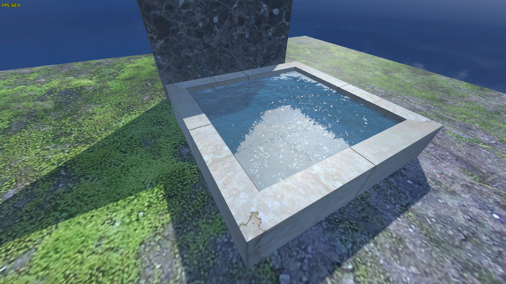

# Ukázka scény s vodou (Water Shader Demo)

Tento projekt je technickou ukázkou implementace **vodního shaderu** v prostředí **Godot Engine 4.5.1**. Demonstruje základní nastavení 3D scény, vykreslování hladiny s odrazy a implementaci pomocných skriptů pro správu aplikace a sledování výkonu.

## Technické parametry

* **Engine:** Godot Engine 4.5.1
* **Typ projektu:** 3D scéna (Node3D)
* **Autor:** Lubomír Tomandl - Angry Developer Studio

## Struktura klíčových skriptů

### 1. `Main.gd`

Hlavní řídicí centrum scény. Zajišťuje základní životní cyklus aplikace.

* **Funkce:** Inicializace scény a globální ovládání.
* **Vstupy:** Obsahuje logiku pro rychlé ukončení aplikace pomocí klávesy `ESC` (akce `ui_cancel`).

### 2. `FpsLabel.gd`

Pomocný UI skript připojený k uzlu `Label`.

* **Účel:** Monitoring výkonu v reálném čase.
* **Vlastnosti:** Každý snímek aktualizuje textovou hodnotu na základě aktuálního výstupu z `Engine.get_frames_per_second()`.

## Implementace vody

Voda je realizována pomocí dedikovaného shaderu, který simuluje:

* Plynulou animaci vln.
* Lom světla a odrazy okolního prostředí.
* Texturu s mramorovým okrajem bazénku (viditelné na screenshotu).

## Ovládání
* **ESC:** Okamžité ukončení ukázky a návrat do editoru / na plochu.

---

### Jak spustit
1. Stáhněte si projekt a otevřete jej v **Godot Engine 4.5.1**.
2. Spusťte hlavní scénu (klávesa `F5`).
3. Sledujte ukazatel FPS v levém horním rohu pro ověření plynulosti shaderu.

---

**© Lubomír Tomandl - Angry Developer Studio**

---
